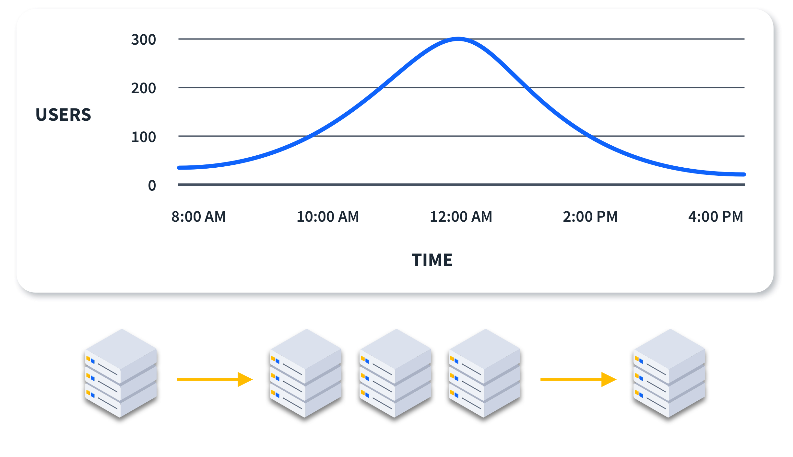
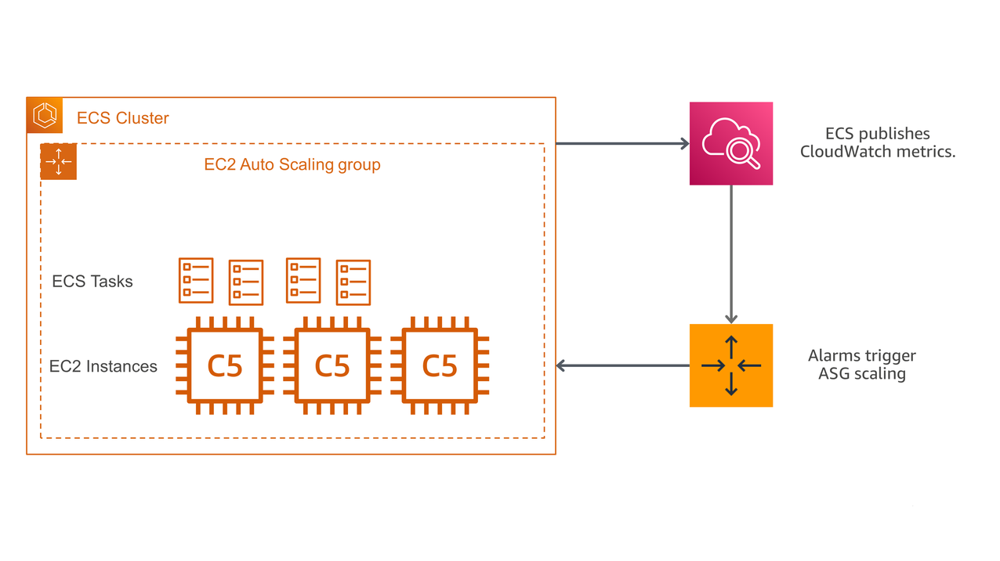

# Elasticity

### Definition

Elasticity is the ability to acquire resources as you need them and release resources when you no longer need them.

## Why use Elasticity?

This is incredibly important for resource management when hosting online. If you have a set amount of resources, you likely will have a portion of them sitting idle almost all the time, racking up costs. But if you have a surge in customers, you likely won't have enough and your system will either experience serious latency or crash altogether. This is a lose-lose situation that is remedied by having an elastic service.

Automation is the key to elasticity being as good as it is. This automation can be triggered by any of a number of metrics, like active users, CPU usage, memory usage, or network bandwidth. These then fire off one of two actions which are the other two key components of elasticity: the provisioning or de-provisioning of resources. This way, both over- and under-provisioning are avoided.

As the number of users goes up, more resources are allocated to the system. When the number of users goes back down, those extra resources are de-allocated.

## Challenges of Elasticity

There are some things to think about when it comes to elasticity. 

For example, how do you know when to set up your system to allocate more resources? How many users can a single server handle?

New resources can take some time (several minutes) to be allocated.

Additionally, you need to set up accurate metric tracking since that's often how the system decides to allocate more resources. If your metrics are inaccurate, or you don't have any metrics, your system will have no idea when it needs to be elastic.

## Elasticity in AWS

The majority of AWS service were designed with elasticity. Some services are automatically elastic as part of their service, such as Amazon S3, SQS, SNS, Aurora, etc. Some require vertical scaling, like Amazon RDS. Others integrate with AWS Auto Scaling, like EC2, ECS, Fargate, and DynamoDB.

### Implementing Elasticity

The following are instructions taken from an info page on AWS

- Identify the workloads that have variable load.
- Identify the workload load range. That is, is there enough variability to warrant adding or removing resources?
- Identify the application limitations (sessions, long initialization, licensing, etc.) that may limit elasticity.
- Identify if the increase in demand can be met by automatic scaling, or if it needs to be in place before (for events, launches, etc.).
- Identify applications that can use Amazon Athena or Amazon Aurora Serverless
- Implement elasticity using AWS Auto Scaling or Application Auto Scaling for the aspects of your service that are not elastic by design.
- Test elasticity both up and down, ensuring it will meet requirements for load variance.
- Iterate on implementation and testing until you can meet requirements. You may want to investigate golden Amazon Machine Images, docker containers, etc. to speed launch.

### A Few Examples of How Elasticity works with AWS Services

#### AWS Lambda
Elastic scalability is fully built-in and automatic with AWS Lambda. The service executes your code only when needed. When a function is invoked for the first time, Lambda creates an instance and runs the handler. The instance stays warm after processing an event, ready for more invocations. If new events arrive while an instance is busy, Lambda automatically creates additional instances to process them concurrently. As traffic increases, Lambda spins up more instances as needed. When traffic decreases, it scales down by stopping unused instances.

#### Amazon ECS (Elastic Container Service)
Amazon ECS cluster auto scaling lets you control how tasks scale within a cluster by using capacity providers, which define the underlying infrastructure, and capacity provider strategies, which determine how tasks are distributed across that infrastructure. Clusters come with a default strategy, but you can override it when launching tasks or services if you so desire.  
ECS integrates with Amazon CloudWatch to monitor metrics like CPU and memory usage, enabling service auto scaling to add tasks during high demand and remove them during low usage to optimize cost. Beyond scaling tasks, cluster auto scaling manages the underlying EC2 infrastructure by automatically adjusting auto scaling groups through capacity providers. This allows ECS to handle infrastructure scaling for you, so you can focus on running tasks without manual intervention.

## Final Thoughts

The concept of elasticity is incredibly useful for reducing the cost and use of resources online. With elastic services, you avoid both spending money on unused resources and having your system crash from not enough resources. The problem of over-provisioning and under-provisioning are both solved with elasticity. Most AWS services have elasticity built-in, so it is very easy and simple to host elastic resources through AWS. This is especially useful for making all parts of your system elastic together. The best part is that this all can happen automatically, thus reducing toil and fulfilling our DevOps mantra.